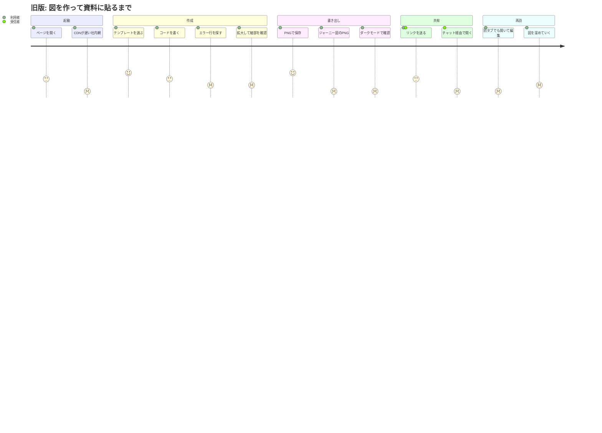
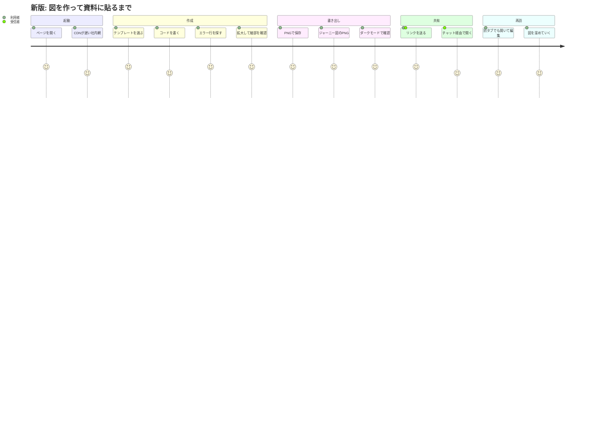

# Mermaid図エディタ 品質分析レポート（v2.0）

対象: `index.html`（単一ファイル・ビルド不要の Mermaid 図エディタ）／ Mermaid 11.16.0
方法: ①コード精読で仮説を立てる → ②Playwright で実際に壊しにいく（破壊テスト）→ ③ユーザージャーニーで体験上の影響度を評価 → ④修正 → ⑤同じテストで回帰確認

---

## 1. 結論

- 旧版の破壊テストで **致命的な不具合 9 件**（データ消失 3・起動不能 2・主要機能の故障 4）と、エラー行のずれ・入力のたびのズームリセット・undo 不可などの**体験上の問題**を確認した。
- すべて修正し、`tests/editor.test.mjs` の 31 ケースを自動化した。新版は **31/31 合格**（2 回連続）。旧版は B05 以外の 26 ケース中 **24 件不合格**（合格は XSS と スマホ幅の 2 件のみ）。
- 特に影響が大きかったもの:
  1. **ジャーニー図だけ PNG 書き出し・画像コピーが必ず失敗**していた（`journey.textPlacement` の既定が `fo` のため canvas が汚染される）。
  2. **複数タブ・容量超過・保存データ破損で、作った図が無言で消える／起動しなくなる**。
  3. **ダークモードで図がほぼ見えない**（白いカードに明るい線）。

---

## 2. ユーザージャーニー分析

想定ペルソナ: 業務で設計書・手順書に図を貼る会社員（Mermaid は少し書ける）。社内ネットワーク・ノート PC・ときどきスマホ。

スコアは 1（強い不満）〜 5（満足）。旧版の実測挙動に基づく。

### 2.1 旧版（v1）



| 段階 | 体験 | 原因（破壊テストで確認） | ID |
|---|---|---|---|
| 起動 | CDN が遅いと最大 36 秒「準備中…」のまま、**エディタも空**。保存済みのコードすら見られない | Mermaid 読込完了まで全処理を `await` で止めていた。CDN は 12 秒ずつ直列に試行 | B03, B04 |
| 起動 | 保存データが一部壊れていると**二度と起動しない** | `[null]` などで `d.id` 参照が例外 | B01 |
| 起動 | プライベートモード等で localStorage が例外を投げると停止 | 直接 `localStorage.*` を呼んでいた | B02 |
| 作成 | エラー行が**ずれる**（先頭の空行・frontmatter・`%%{init}%%`・`%%` コメントがあると数行ずれる） | Mermaid は前処理でそれらを削除してから行番号を数える | B05 |
| 作成 | 拡大して細部を見ていても、1 文字打つたびに**全体表示へ戻される** | 描画ごとに無条件で `fitView()` | B12 |
| 作成 | Tab でインデントすると **Ctrl+Z が効かない**。Tab でエディタから抜けられない（キーボードトラップ） | `value` 直接代入で undo 履歴が消える | B06, B07 |
| 作成 | 辺が 500 本を超えると Mermaid 既定上限でエラー | `maxEdges` 既定値 | B14 |
| 書き出し | **ジャーニー図の PNG 保存・画像コピーが必ず失敗** | ジャーニー図は `<foreignObject>` で文字を描くため canvas が汚染 | B08 |
| 書き出し | **ダークモードで図が読めない**。ダークのまま SVG 保存すると透明背景に明るい線 | プレビューのカードが常に白 | B10 |
| 書き出し | ファイル名が `mermaid-日時.png` だけで、どの図か分からない | | F02 |
| 共有 | チャットツールが `+` `/` `=` を `%2B` 等に変換すると、**リンクが無言で無視**される | `atob` 失敗を握りつぶしていた | S02, S03 |
| 共有 | 同じリンクを開くたびに「共有図」が増える。同じタブで別リンクを貼っても反応しない | 重複判定なし・`hashchange` 未対応 | S01 |
| 再訪 | **2 つのタブで開くと、後から保存したタブが他方の新規図を消す** | ドキュメント一覧全体を上書き保存 | D02 |
| 再訪 | 容量（約 5MB）を超えると**保存が無言で全失敗** | 例外を握りつぶし | D01 |
| 再訪 | 削除の取り消しができない | | D03 |

### 2.2 新版（v2）



残る課題（スコア 4 の理由）:
- CDN が完全に遮断された環境では図は描けない（編集・保存・.mmd 書き出しは可能で、再試行ボタンあり）。Mermaid の同梱（オフライン版）は今後の検討事項。
- 共有リンクは内容を URL に埋め込む方式のため、非常に大きな図は長い URL になる（8,000 文字超で警告。圧縮により旧形式より小さな図で約 1.3 倍、中規模で約 2 倍短い）。
- 保存先はブラウザの localStorage のみ（約 5MB）。容量超過時は警告し、.mmd 書き出しを案内する。

---

## 3. ジャーニー図（`journey`）そのものの破壊テスト

Mermaid の `journey` は誤った記述でも**エラーにならず黙って誤描画**するケースが多いため、エディタ側でチェックを追加した（警告欄に行番号付きで表示、クリックでその行へ移動）。

| 入力 | Mermaid の挙動 | 新版の対応 |
|---|---|---|
| `時刻 10:00 起床: 3: 私` | タスク名が「時刻 10」、スコア NaN、アクター「3」に化ける | 半角「:」を警告し全角「：」を提案 |
| スコア `0` / `7` / `-1` / `3.5` / `abc` | エラーにならず顔アイコンが枠外などに描かれる | 1〜5 の整数でないものを警告 |
| アクター未指定 `t: 3` | 凡例が空のまま描画 | 警告（記入例つき） |
| 長いタスク名（全角 10 文字超） | 旧: foreignObject の高さで**切り捨て**／tspan: 枠からはみ出す | 警告し `<br>` での改行を案内（tspan は `<br>` に対応） |
| アクター 7 人以上 | 既定 6 色が循環し、別人が同じ色になる | 判別しやすい 10 色に変更。11 人以上で警告 |
| 100 タスク | 幅 20,000px 超。描画は可能 | 全体表示で収める。PNG は Canvas 上限（辺 8192px・面積 16.7M px）内に自動縮小し通知 |
| `` 等のラベル | `securityLevel: strict` で無害化される | 変更なし（B15 で回帰確認） |
| CRLF / タブ字下げ / `accTitle` | 正常 | 変更なし |

また、PNG 化のため `textPlacement: 'tspan'` にしたところ、**セクション名が枠と同じ色・タスク名が白で描かれ読めなくなる** Mermaid 側の不整合を見つけたため、`themeCSS` で文字色を補正している（J02）。

---

## 4. 修正一覧

### データ保全
- 保存データの正規化（壊れた要素の除去・欠損フィールド補完）
- localStorage 例外時はメモリ保存に切り替え、利用者に通知
- 保存はタブ間マージ（ドキュメント単位で新しい方を採用）＋削除のトゥームストーン。`storage` イベントで他タブの変更を即時反映
- 容量超過を通知し、ステータスを「未保存」に固定。未保存のまま閉じようとすると確認
- `pagehide` / `visibilitychange` でも保存（モバイルで `beforeunload` が来ない対策）
- 削除の「元に戻す」

### 起動・読込
- エディタを Mermaid の読込と切り離し、即座に保存済みコードを表示
- CDN は 4 秒応答がなければ次を並行して試すヘッジ方式。失敗時はプレビュー内に案内と再試行ボタン

### 作成体験
- エラー行番号を Mermaid の前処理を再現して元の行へ補正（エラー文言内の行番号も補正）
- 手動でズーム／パンしたら再描画で視点を維持（全体表示ボタンで自動追従に復帰）
- Tab / Shift+Tab（複数行）、Ctrl+/ でコメント切替、Enter で自動インデント。すべて undo 可能
- Esc → Tab でエディタから抜けられる（WCAG 2.1.2）
- エラー時は前回成功した図を薄く表示し「前回成功した図を表示中」を明示。書き出しは無効化
- ホイールズームを入力量に比例させ、トラックパッドのピンチで暴走しないように
- 境界線のキーボード操作・比率の保存・ダブルクリックで初期化
- `maxEdges` 500 → 3000、`maxTextSize` 5 万 → 50 万字。巨大図でスタックが溢れた場合は分割を促すメッセージ

### 書き出し・共有
- ジャーニー図の PNG／画像コピーを修正。その他の図でも `<foreignObject>` を PNG 化時に `<text>` へ置換する保険
- 図の背景を図テーマに連動（プレビュー・PNG・SVG で一致）。図テーマを UI テーマと独立して選択可能に
- ファイル名にドキュメント名を使用
- 共有リンクを `deflate-raw` 圧縮 + base64url（`#z=`）に。旧形式 `#code=` とパーセントエンコードされたリンクも読める。壊れたリンクは通知、同一内容は再利用、`hashchange` に対応
- ファイル読込: 2MB 上限、バイナリ拒否、BOM・CRLF 正規化、Markdown の ```` ```mermaid ```` ブロック抽出

### その他
- OS のダークモード設定に追従（明示的に選んだ場合はそれを優先）
- F1 でヘルプ、Ctrl/Cmd+S で即時保存（ブラウザの「ページを保存」を抑止）

---

## 5. テスト

```bash
npm install
npm test
```

- CDN へのリクエストを `node_modules/mermaid/dist` に差し替えて実行するため、オフライン・CDN 遮断環境でも動く。
- 旧版との比較: `MMD_APP=/path/to/old/index.html npm test`
- Linux でロケール未設定だと Chromium が日本語のダウンロード名を `download` に置き換えるため、テストでは `LANG=C.UTF-8` を設定している（アプリの不具合ではない）。

| ID | 内容 | 旧版 | 新版 |
|---|---|---|---|
| B01 | 壊れた保存データで起動 | ✗ | ✓ |
| B02 | localStorage 使用不可 | ✗ | ✓ |
| B03 | CDN 全滅時もエディタが使える | ✗ | ✓ |
| B04 | CDN ヘッジ | ✗ | ✓ |
| B05 | エラー行番号の補正（5 パターン） | ✗※ | ✓ |
| B06 | Tab/Shift+Tab/コメント/undo/Esc→Tab | ✗ | ✓ |
| B07 | テンプレート置換の undo | ✗ | ✓ |
| B08 | 全テンプレートの描画 + PNG | ✗ | ✓ |
| B09 | foreignObject を含む図の PNG | ✗ | ✓ |
| B10 | ダークテーマの背景（プレビュー/PNG/SVG） | ✗ | ✓ |
| B11 | 描画中のドキュメント切替 | ✗ | ✓ |
| B12 | 手動ズームの維持 | ✗ | ✓ |
| B13 | エラー時の前回図表示と書き出し無効化 | ✗ | ✓ |
| B14 | 辺 600 本 | ✗ | ✓ |
| B15 | XSS | ✓ | ✓ |
| J01–J03 | ジャーニー図チェック・文字色・色数 | ✗ | ✓ |
| D01 | 容量超過の通知 | ✗ | ✓ |
| D02 | 複数タブ同期 | ✗ | ✓ |
| D03 | 削除の取り消し | ✗ | ✓ |
| S01–S03 | 共有リンク（圧縮・旧形式・破損） | ✗ | ✓ |
| F01–F02 | ファイル読込の検証・書き出し名 | ✗ | ✓ |
| L01 | スマホ幅で横スクロールなし | ✓ | ✓ |

※ B05 は旧版を自動テストでは測っていないが、手動プローブで「frontmatter 付き 6 行目のエラーを 3 行目と表示」などのずれを確認済み。旧版の不合格には、機能自体が存在しないことによるもの（B04・D03 など）も含む。
